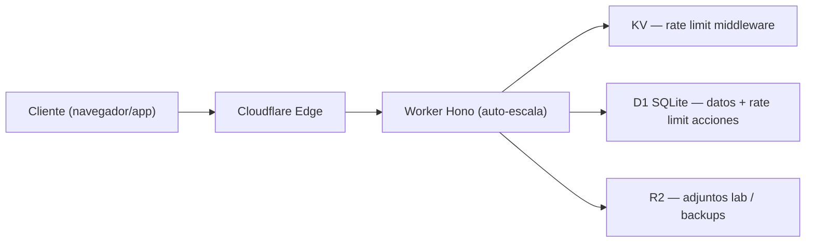

# Concurrencia y carga alta — PodoAdmin

Documento técnico: qué ocurre cuando llegan **cientos de peticiones simultáneas** y cómo el sistema responde.

---

## 1. Arquitectura de request



| Capa | Comportamiento bajo carga |
|------|---------------------------|
| **Cloudflare Edge** | Distribuye tráfico entre PoPs; no hay servidor único |
| **Worker** | Escala horizontalmente (múltiples isolates); CPU ~30 ms/request típico |
| **D1** | **Un writer a la vez** — cuello de botella principal |
| **KV** | Lecturas/escrituras rápidas, consistencia eventual (aceptable para rate limit) |
| **R2** | Escala bien; no compite con D1 en lecturas de API |

---

## 2. Flujo de una petición API autenticada

Orden real del middleware (`src/api/index.ts`):

1. `blockSensitivePaths` — bloqueo de rutas sensibles
2. `requestIdMiddleware` — correlación de logs
3. CORS + CSP + sanitización
4. `authMiddleware` — JWT + **1 SELECT** en `token_blacklist`
5. `globalRateLimitMiddleware` — ráfaga 10 s + tier IP/min → **KV** (o D1 si KV no configurado)
6. `tenantRateLimitMiddleware` — límite por clínica/usuario → **KV**
7. CSRF (mutaciones) + `requireActiveSubscription` (caché 30 s)
8. Handler de ruta — consultas D1 de negocio

### Operaciones D1 por request (post-optimización KV)

| Escenario | D1 reads | D1 writes |
|-----------|----------|-----------|
| GET autenticado (caché acceso caliente) | 1–2 | 0 |
| GET autenticado (caché frío) | 2–4 | 0 |
| POST autenticado | 2–5 | 1+ |
| Login fallido | 3–6 | 2–4 |
| Anónimo sin token | 0 | 0 (solo KV) |

**Antes de KV:** cada request autenticado generaba **2–4 escrituras D1** solo por rate limiting middleware.

---

## 3. Escenario: 300 requests simultáneas

### Tráfico legítimo (usuarios activos en hora pico)

| Fase | Qué pasa |
|------|----------|
| T+0 ms | Cloudflare abre N isolates Worker; cada uno atiende requests en paralelo |
| T+0–50 ms | Rate limit en KV absorbe contadores sin tocar D1 |
| T+50–200 ms | D1 atiende lecturas de negocio; escrituras se **serializan** |
| Si > límites configurados | HTTP **429** con `Retry-After`; cliente debe reintentar con backoff |
| Si D1 saturada | Latencia sube (p95 > 500 ms); Sentry registra timeouts |

**Límites de referencia (producción, `wrangler.json`):**

| Tier | Límite |
|------|--------|
| Ráfaga IP (10 s) | 80 req |
| Lectura autenticada IP/min | 600 |
| Escritura autenticada IP/min | 300 |
| Lectura tenant/min | 2000 |
| Escritura tenant/min | 800 |

Con 300 usuarios distintos en la misma ventana, cada uno dentro de su cuota → **sistema estable**.

Con 300 requests de **una sola IP** en <10 s → **429** tras la ráfaga (protección anti-DDoS).

### Tráfico malicioso (DDoS / fuerza bruta login)

| Vector | Protección |
|--------|------------|
| Flood GET/POST anónimo | Rate limit global IP + ráfaga |
| Brute force login | Rate limit progresivo email:IP + tope IP (50 fallos/h) |
| Registro masivo | 3 niveles progresivos por IP |
| Una clínica monopoliza recursos | Rate limit tenant |
| IP de confianza (monitoring) | `IP_WHITELIST` bypass |

**Fail-closed en producción:** si D1 falla en rate limit de **acciones** (login, logos), se rechaza con 429/503 en lugar de dejar pasar.

---

## 4. Cuellos de botella actuales

### Críticos (mitigados parcialmente)

| Cuello | Impacto | Estado |
|--------|---------|--------|
| Rate limit middleware en D1 | 2–4 writes/request | ✅ Migrado a KV |
| `token_blacklist` sin cleanup | Tabla crece; SELECT en cada auth | ✅ Cron diario |
| Índices `created_by` | Full scan en listados | ✅ Migración 0036 |

### Pendientes (Fase 2b)

| Cuello | Impacto | Acción recomendada |
|--------|---------|-------------------|
| Imágenes base64 en D1 | Filas grandes, I/O lento | Migrar a R2 |
| Cron recordatorios WhatsApp | O(n) citas sin paginar | Filtrar ventana + Queue |
| Caché acceso en memoria | No compartida entre isolates | KV con TTL |
| Refresh token sin rate limit | Tormenta de renovaciones | Límite por IP/user |
| Lab attachments sin paginación | SELECT * en memoria | Paginar endpoint |
| Colas async (email, WhatsApp) | Requests lentos bloquean Worker | Cloudflare Queues |

---

## 5. Capacidad objetivo

| Métrica | Objetivo |
|---------|----------|
| Podólogos activos simultáneos | 500–1 000 |
| Requests autenticados por IP/min | 600 lecturas |
| Tenant sin clínica | 2 000 lecturas/min |
| Pacientes por consultorio | ~5 000 |
| Pico sostenido Worker | Miles req/s (limitado por D1, no por CPU Worker) |

D1 en plan Workers Paid: ~1 000 writes/s teóricos, pero latencia crece con contención. **KV desacopla el rate limit del writer D1.**

---

## 6. Respuesta del sistema al cliente (contrato API)

Cuando se supera un límite:

```http
HTTP/1.1 429 Too Many Requests
Retry-After: 42
Content-Type: application/json

{
  "error": "rate_limit",
  "message": "Demasiadas solicitudes desde esta red. Espera un momento e inténtalo de nuevo.",
  "retryAfter": 42,
  "scope": "ip"
}
```

**Recomendación frontend:** respetar `Retry-After`, backoff exponencial, no reintentar en bucle.

---

## 7. Monitorización

| Señal | Dónde |
|-------|-------|
| Latencia p95 API | Sentry traces (15 % sample) |
| Errores 429 | Logs estructurados + Sentry |
| Cron backup/retención | `cron_*` events en logs |
| Saturación D1 | Cloudflare dashboard → D1 analytics |

Alertas sugeridas:

- p95 `/api/*` > 800 ms durante 5 min
- Tasa 429 > 5 % del tráfico durante 10 min
- Cron `d1-backup` fallido

---

## 8. Despliegue KV (producción)

```bash
# Crear namespace (una vez)
wrangler kv namespace create RATE_LIMIT_KV
wrangler kv namespace create RATE_LIMIT_KV --env production

# Copiar el id en wrangler.json → kv_namespaces
```

Sin KV configurado, el sistema **degrada a D1** (comportamiento anterior).

---

## 9. Verificación local

```bash
bun run db:migrate
bun run test
bun dev
# Probar: abrir muchas pestañas en /api/patients → debe responder, no 500
```

---

## 10. Roadmap

| Fase | Entregable | Estado |
|------|------------|--------|
| 1 | Paginación, caché acceso, índices | ✅ |
| 2a | Rate limit middleware → KV, cleanup tokens, índices 0036 | ✅ |
| 2b | Imágenes → R2, Queues WhatsApp, caché KV acceso | Pendiente |
| 3 | Durable Objects para contadores exactos (si KV no basta) | Opcional |

Ver también: `docs/SCALE_INDEPENDIENTES.md`, `docs/PLATAFORMA_NIVELES_SISTEMA.md`, `docs/MODULOS_MANTENIMIENTO.md`.
